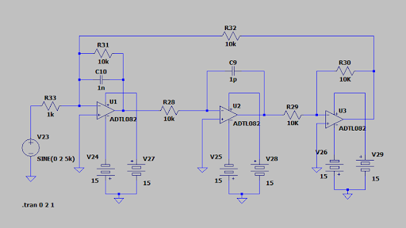
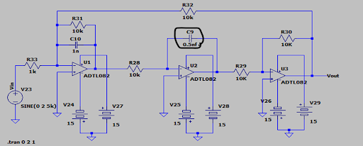

# AI-Driven Fault Detection in Biquad Filter Circuits 🛡️⚡

##  Project Overview
This project leverages **Artificial Neural Networks (ANN)** and **Support Vector Machines (SVM)** to intelligently detect and classify component faults in electronic circuits. The study focuses on an active **Biquad Filter**, analyzing how small variations in component values affect the circuit's behavioral features.

##  Circuit Design & Simulation
The circuit is an active Biquad Filter designed using **ADTL082** Op-Amps. We performed fault simulation by introducing specific deviations in component values to observe the system's response.

### Circuit Schematics
To analyze the system, we compared the nominal state with a faulty state:

| **Normal State (Healthy)** | **Faulty State (C9 Deviation)** |
| :---: | :---: |
|  |  |
| *Nominal Values (C_9 = 1pF)* | *Faulty Value (C_9 = 0.5nF)* |

---

##  Machine Learning Performance
The models were trained and tested on a dataset containing 510 samples, covering 51 different fault classes (Single and Double faults).

### Results Summary
| Model | Test Accuracy |
| :--- | :---: |
| **Artificial Neural Network (ANN)** | **99.34%** |
| **Support Vector Machine (SVM)** | **91.50%** |

##  Conclusion & Engineering Analysis
The high accuracy achieved (especially by the ANN) proves that machine learning can effectively automate hardware diagnostics.

###  Why did ANN outperform SVM?
1. **Non-Linear Mapping:** The relationship between component values and circuit output (F1-F4) in a Biquad filter is highly non-linear. The ANN's hidden layers and **Tanh** activation functions are superior at capturing these complex patterns compared to the SVM's kernel.
2. **Feature Interaction:** ANN inherently learns the interactions between multiple failing components (Double Faults), providing a more robust classification.
3. **Stochastic Optimization:** As seen in the training logs, the ANN converged to a state where it could near-perfectly distinguish between the 51 classes.

## Project Structure
* `faulty_detection_model.py`: The core Python script for dataset generation and model training.
* `biquad_fault_dataset.csv`: The generated synthetic dataset.
* `model_comparison.csv`: Exported accuracy results for both models.
* `requirements.txt`: Necessary Python libraries (Pandas, Scikit-learn, Numpy).

##  How to Run
1. Clone the repository.
2. Install dependencies: `pip install -r requirements.txt`.
3. Run the model: `python faulty_detection_model.py`.
