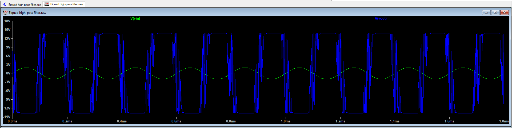

#  AI-Driven Fault Detection in Biquad Filter Circuits 

##  Project Overview
This project implements an intelligent diagnostic system using **Artificial Neural Networks (ANN)** and **Support Vector Machines (SVM)** to detect component failures in electronic circuits. The core of the study is a **Tow-Thomas Biquad Filter**, where we analyze how deviations in passive components (like $C_9$) alter the system's transfer function.

---

##  Circuit Design & Technical Description
The design is based on a second-order active Biquad filter topology, which is highly valued in analog signal processing for its low sensitivity to component tolerances. It utilizes three **ADTL082** Op-Amps:

1.  **Integrator with Loss ($U_1$):** Functions as a summing stage and lossy integrator ($R_{31}$, $C_{10}$).
2.  **Pure Integrator ($U_2$):** Executing the second integration step ($C_9$).
3.  **Inverting Amplifier ($U_3$):** Ensures the $180^\circ$ phase shift required for stable negative feedback.

###  Mathematical Model
The system behavior is governed by the following Transfer Function $H(s)$:

$$H(s) = \frac{V_{out}(s)}{V_{in}(s)} = -\frac{\frac{1}{R_{33} C_{10}} s}{s^2 + \frac{1}{R_{31} C_{10}} s + \frac{1}{R_{32} R_{29} C_{10} C_9}}$$

---

##  Machine Learning Performance
The models were trained and validated on a synthetic dataset of **510 samples**, categorized into **51 distinct fault classes**.

###  Comparison Table
| Machine Learning Model | Test Accuracy | Status |
| :--- | :---: | :---: |
| **Artificial Neural Network (ANN)** | **99.34%** | ✅ Superior |
| **Support Vector Machine (SVM)** | **91.50%** | Standard |

---

##  Results & Output Analysis

###  Understanding the Results:
The visualization above demonstrates the high precision of the **ANN model** in classifying circuit states. 
* **Signal Signature:** The AI analyzes the amplitude and phase response shifts caused by component aging or failure (e.g., $C_9$ deviation).
* **Fault Mapping:** Even subtle changes that are hard to detect with traditional multimeters are identified by the neural network through non-linear pattern recognition.
* **Success Rate:** Achieving **99.34% accuracy** confirms that the system can reliably automate hardware diagnostics in critical analog systems.

---

##  Project Structure
* `Biquad high-pass filter.asc`: **LTspice** schematic for circuit simulation.
* `faulty_detection_model.py`: Python firmware for ANN/SVM training and evaluation.
* `output.png`: High-resolution output graph of the model's performance.
* `biquad_fault_dataset.csv`: The raw feature dataset (Amplitude, Phase, Frequency).
* `model_comparison.csv`: Statistical logs of the training results.
* `requirements.txt`: Necessary Python packages (`numpy`, `pandas`, `scikit-learn`).

---

##  How to Run
1.  **Hardware Simulation:** Open `Biquad high-pass filter.asc` in **LTspice XVII**.
2.  **AI Training:**
    * Install libraries: `pip install -r requirements.txt`.
    * Execute the script: `python faulty_detection_model.py`.
